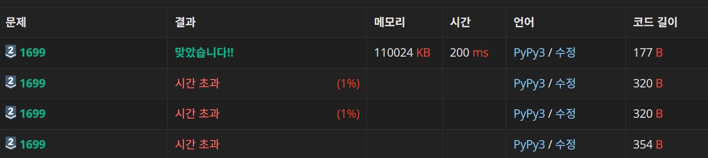

# 1699 제곱수의 합(실버 2)

### 풀이 일자

2024년 6월 4일

## 알고리즘 분류

- 수학
- 다이나믹 프로그래밍

## 내 초기 풀이 방향(시간초과)

```python
n = int(input())
dp = [21e18] * (n+1)
dp[0] = 0
dp[1] = 1
for i in range(2, n+1):
    if i==2:
        dp[i] = 2
    elif i==3:
        dp[i] = 3
    else:
        if (i**0.5)%1==0:
            dp[i] = 1
        else:
            for j in range(1, n//2+1):
                dp[i] = min(dp[i], dp[j]+dp[i-j])
                print(f'i = {i}, j = {j}, dp[i] = {dp[i]}') # 디버깅을 위한 코드

print(dp[n])
```



처음에는 시간 초과가 나왔다. 이 부분에 대해서 왜 시간초과가 나는지 모르겠어서 나는 뤼튼의 힘을 빌렸다.

`15`를 넣고 출력을 하니 아래와 같은 결과물이 나왔다.

```
<입력>
15
<아래부터는 디버깅 코드를 출력한 내역이다>
i = 5, j = 1, dp[i] = 2
i = 5, j = 2, dp[i] = 2
i = 5, j = 3, dp[i] = 2
i = 5, j = 4, dp[i] = 2
i = 5, j = 5, dp[i] = 2
i = 5, j = 6, dp[i] = 2
i = 5, j = 7, dp[i] = 2
i = 6, j = 1, dp[i] = 3
i = 6, j = 2, dp[i] = 3
i = 6, j = 3, dp[i] = 3
i = 6, j = 4, dp[i] = 3
i = 6, j = 5, dp[i] = 3
i = 6, j = 6, dp[i] = 3
i = 6, j = 7, dp[i] = 3
i = 7, j = 1, dp[i] = 4
i = 7, j = 2, dp[i] = 4
i = 7, j = 3, dp[i] = 4
i = 7, j = 4, dp[i] = 4
i = 7, j = 5, dp[i] = 4
i = 7, j = 6, dp[i] = 4
i = 7, j = 7, dp[i] = 4
i = 8, j = 1, dp[i] = 5
i = 8, j = 2, dp[i] = 5
i = 8, j = 3, dp[i] = 5
i = 8, j = 4, dp[i] = 2
i = 8, j = 5, dp[i] = 2
i = 8, j = 6, dp[i] = 2
i = 8, j = 7, dp[i] = 2
i = 10, j = 1, dp[i] = 2
i = 10, j = 2, dp[i] = 2
i = 10, j = 3, dp[i] = 2
i = 10, j = 4, dp[i] = 2
i = 10, j = 5, dp[i] = 2
i = 10, j = 6, dp[i] = 2
i = 10, j = 7, dp[i] = 2
i = 11, j = 1, dp[i] = 3
i = 11, j = 2, dp[i] = 3
i = 11, j = 3, dp[i] = 3
i = 11, j = 4, dp[i] = 3
i = 11, j = 5, dp[i] = 3
i = 11, j = 6, dp[i] = 3
i = 11, j = 7, dp[i] = 3
i = 12, j = 1, dp[i] = 4
i = 12, j = 2, dp[i] = 4
i = 12, j = 3, dp[i] = 4
i = 12, j = 4, dp[i] = 3
i = 12, j = 5, dp[i] = 3
i = 12, j = 6, dp[i] = 3
i = 12, j = 7, dp[i] = 3
i = 13, j = 1, dp[i] = 4
i = 13, j = 2, dp[i] = 4
i = 13, j = 3, dp[i] = 4
i = 13, j = 4, dp[i] = 2
i = 13, j = 5, dp[i] = 2
i = 13, j = 6, dp[i] = 2
i = 13, j = 7, dp[i] = 2
i = 14, j = 1, dp[i] = 3
i = 14, j = 2, dp[i] = 3
i = 14, j = 3, dp[i] = 3
i = 14, j = 4, dp[i] = 3
i = 14, j = 5, dp[i] = 3
i = 14, j = 6, dp[i] = 3
i = 14, j = 7, dp[i] = 3
i = 15, j = 1, dp[i] = 4
i = 15, j = 2, dp[i] = 4
i = 15, j = 3, dp[i] = 4
i = 15, j = 4, dp[i] = 4
i = 15, j = 5, dp[i] = 4
i = 15, j = 6, dp[i] = 4
i = 15, j = 7, dp[i] = 4
<결과물>
4
```

어떻게 수정해야 될지 몰라서 결국 뤼튼의 도움을 좀 받았다.<br/>
뤼튼은 아래와 같이 이야기했다.

```
내부 반복문에서의 비효율성 때문에 시간 초과가 발생합니다.

시간 초과가 발생한 주된 이유는, 모든 가능한 j에 대해 반복하면서 dp[i]의 최소값을 찾으려고 시도하기 때문입니다. 특히, for j in range(1, n//2+1): 이 부분에서 n이 큰 경우 매우 많은 반복을 수행하게 됩니다.
```

뤼튼의 도움을 받아 아래와 같이 코드를 수정하였다.

```python
n = int(input())
dp = [0] * (n+1)

for i in range(1, n+1):
    dp[i] = i
    j = 1
    while j**2 <= i:
        dp[i] = min(dp[i], dp[i - j**2] + 1)
        print(f'i = {i}, j**2 = {j**2}, dp[i] = {dp[i]}') # 디버깅용 입력
        j += 1

print(dp[n])
```

위의 경우와 똑같이 예제로 `15`를 입력했을 때의 결과를 보겠다.

```
<입력>
15
<디버깅용 입력의 출력 결과>
i = 1, j**2 = 1, dp[i] = 1
i = 2, j**2 = 1, dp[i] = 2
i = 3, j**2 = 1, dp[i] = 3
i = 4, j**2 = 1, dp[i] = 4
i = 4, j**2 = 4, dp[i] = 1
i = 5, j**2 = 1, dp[i] = 2
i = 5, j**2 = 4, dp[i] = 2
i = 6, j**2 = 1, dp[i] = 3
i = 6, j**2 = 4, dp[i] = 3
i = 7, j**2 = 1, dp[i] = 4
i = 7, j**2 = 4, dp[i] = 4
i = 8, j**2 = 1, dp[i] = 5
i = 8, j**2 = 4, dp[i] = 2
i = 9, j**2 = 1, dp[i] = 3
i = 9, j**2 = 4, dp[i] = 3
i = 9, j**2 = 9, dp[i] = 1
i = 10, j**2 = 1, dp[i] = 2
i = 10, j**2 = 4, dp[i] = 2
i = 10, j**2 = 9, dp[i] = 2
i = 11, j**2 = 1, dp[i] = 3
i = 11, j**2 = 4, dp[i] = 3
i = 11, j**2 = 9, dp[i] = 3
i = 12, j**2 = 1, dp[i] = 4
i = 12, j**2 = 4, dp[i] = 3
i = 12, j**2 = 9, dp[i] = 3
i = 13, j**2 = 1, dp[i] = 4
i = 13, j**2 = 4, dp[i] = 2
i = 13, j**2 = 9, dp[i] = 2
i = 14, j**2 = 1, dp[i] = 3
i = 14, j**2 = 4, dp[i] = 3
i = 14, j**2 = 9, dp[i] = 3
i = 15, j**2 = 1, dp[i] = 4
i = 15, j**2 = 4, dp[i] = 4
i = 15, j**2 = 9, dp[i] = 4
<실제 정답>
4
```

반복문 줄 수부터 확연하게 차이가 난다. 내가 작성한 코드를 작동했을 때는 70줄이 나왔는데, 뤼튼이 고쳐준 대로 하니까 43줄이 나왔다. 15라는 작은 숫자에서 벌써 40%가량 반복문 작동 횟수가 줄었는데, 이 문제의 자연수 범위가 `1<=N<=100,000` 이라는 점을 감안한다면 더 큰 수에서는 더 많은 비효율성이 발생할 것이다.

뤼튼이 작성해준 수정 코드와 내가 작성한 코드를 비교해 보면, 내가 작성한 코드의 경우에는 j가 1~i-1 사이인 모든 자연수에서 작동한다. 만일 i가 7이라면 1에서 7까지 7번 반복문이 돌아간다는 뜻이다. 그러나 뤼튼이 작성해준 수정 코드를 보면 j가 제곱수인 경우에만 작동한다. 그래서 위의 예시와 똑같이 i가 7이라고 가정한다면 j는 1, 4일때만 작동한다는 뜻이다. 7번 작동하던 반복문이 2번만 작동함으로써 효율적으로 코드가 개선되었다.

while문을 사용하는게 익숙하지 않아서, while문을 좀 더 자주 사용하도록 해봐야 겠다.
