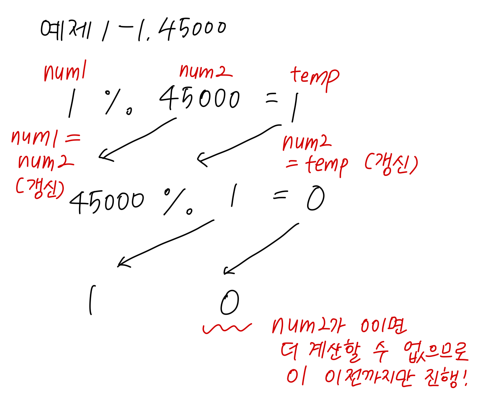

# 1934 최소공배수(브론즈 1)

### 풀이 일자
2023년 10월 27일

## 알고리즘 분류
- 수학
- 정수론
- 유클리드 호제법

## 내 풀이 방향


## 내 코드
```python
def mul(num1, num2):
    temp = 0

    while num2:
        temp = num1%num2
        num1 = num2
        num2 = temp
    return num1

n = int(input())
for i in range(n):
    a, b = map(int, input().split())
    print(int(a*b/mul(a, b)))
```